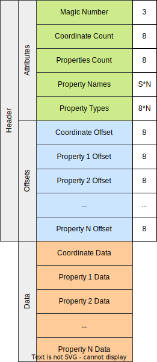

# flatpoints

**flatpoints** is an in-development data format for representing coordinates, particularly [*points of interest*](https://en.wikipedia.org/wiki/Point_of_interest), as a compressed list of integers (i.e. an [inverted list](https://en.wikipedia.org/wiki/Inverted_index)).

## Format

## Braindumping

- Coordinate Encoding Codec: Geohash using Hilbert Curves
- Integer Compression Codec: VTEnc
- Properties Compression: TBD

## References
- Giulio Ermanno Pibiri, Rossano Venturini (2019). "Techniques for Inverted Index Compression." [arXiv:1908.10598v2](https://arxiv.org/abs/1908.10598v2).
- Vicente Romera Calero (2022). "VTEnc". [GitHub Repository](https://github.com/vteromero/VTEnc).
- Vukovic, Tibor (2016). "Hilbert-Geohash - Hashing Geographical Point Data Using the Hilbert Space-Filling Curve."